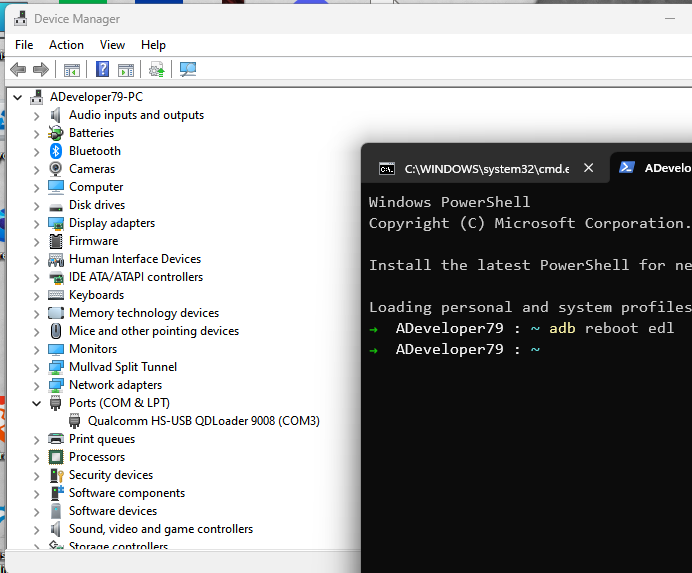

# Backup of Partitions through EDL for ASUS ZenFone 9

This is a guide to backup partitions through EDL for ASUS ZenFone 9. Please follow the steps below:

## Steps

1. Boot your phone into EDL mode through adb by running the following command:
   `adb reboot edl`

2. Open the device manager on your computer and check the port number for 9008 mode.
      
      

3. Run the backup.bat file.

4. Enter the port number that you found in step 2 when prompted.

5. Enter folder names for each LUNs when asked.

6. Let the script do its work. It will backup all the partitions and save them to the respective folders.

7. After Backup is Finished reboot the phone by holding all three buttons for 10-20 seconds.

Note: For now, only backup functionality is implemented in this tool.
